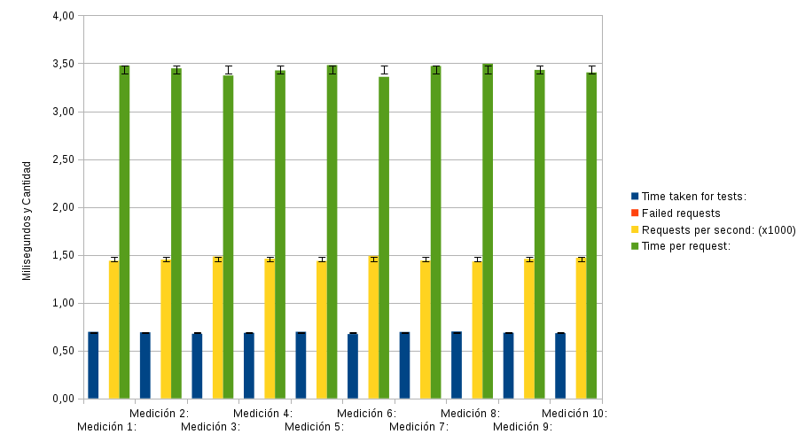
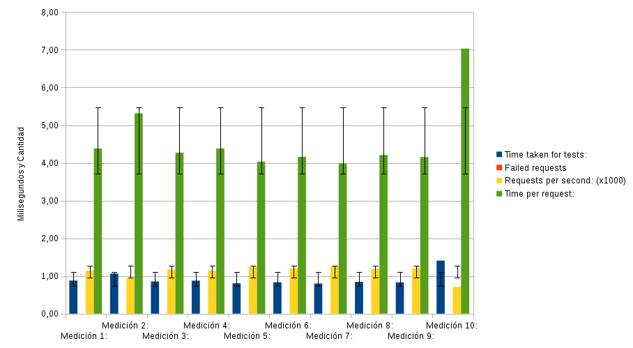
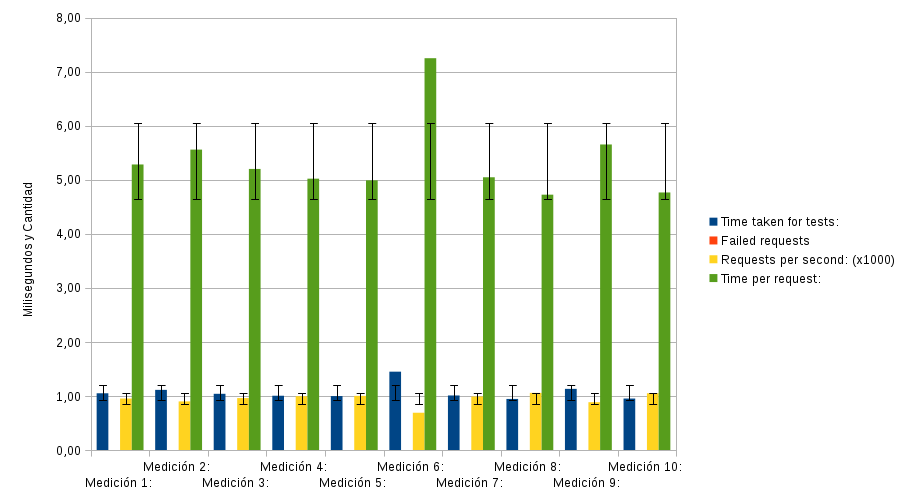
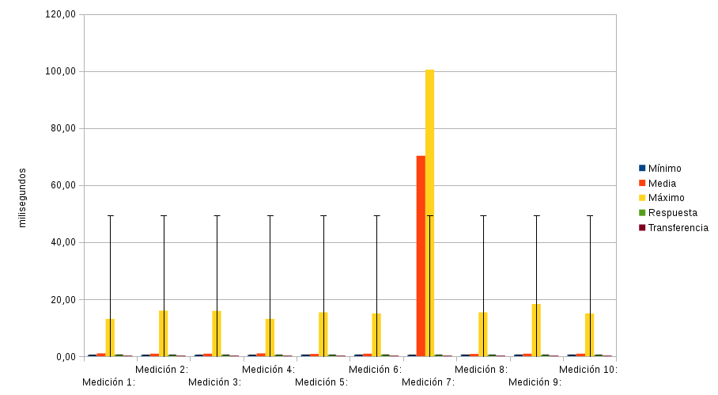
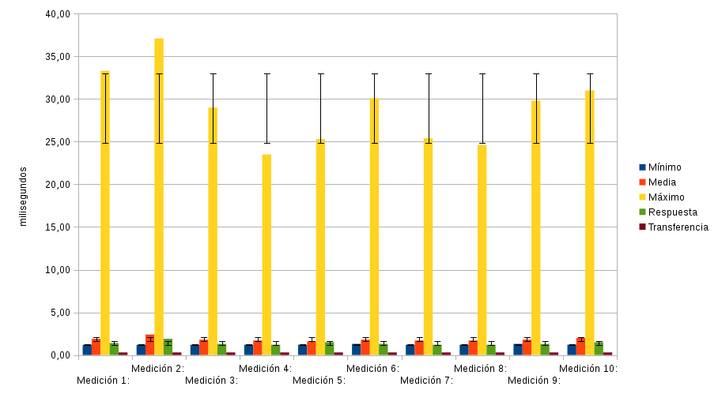
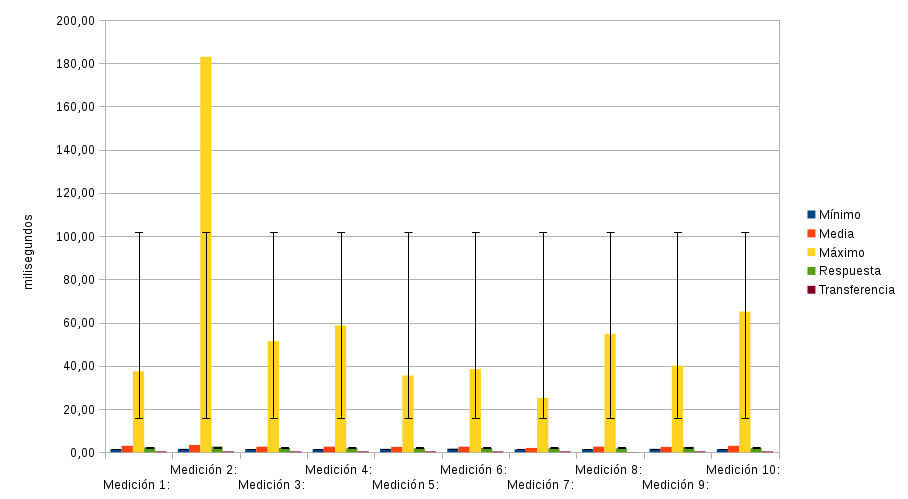
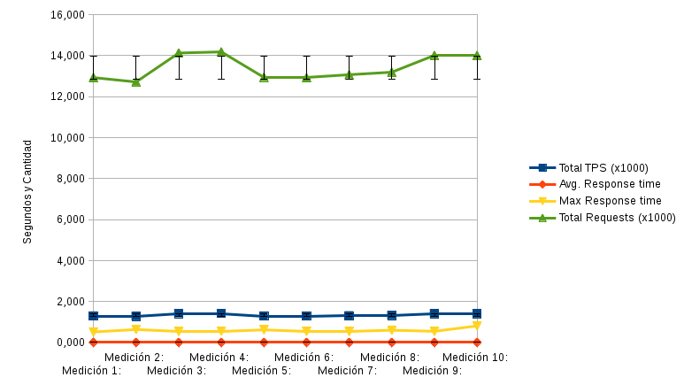
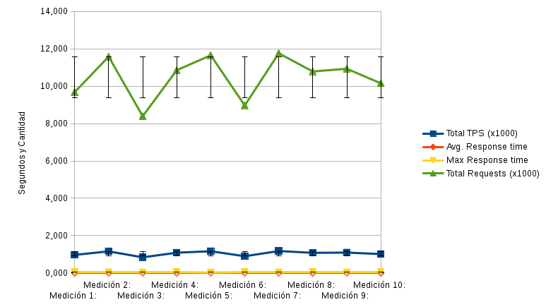
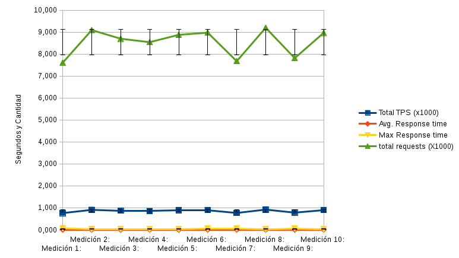

Practica 4 
==========
*Realizando mediciones para comprobar el rendimiento*

### Objetivos
En esta practica vamos a comprobar el rendimiento que tiene nuestra granja web, para ello utilizaremos tres programas diferentes para realizar test de diferentes tipos de estrés para nuestra granja.

### Pasos realizados
> * Paso 1  
> En esta parte de las practicas ya tenemos todos los equipos funcionando a pleno rendimiento así que lo único que queda es realizar las mediciones  
> * Paso 2  
> Preparamos las diferentes tablas que nos van a hacer falta para poder tomar las mediciones, ya que hay 9 escenarios diferentes de los cuales tenemos que tomar medidas.  
> * Paso 3  
> Para hacernos una idea de lo que hay que apuntar en las tablas hacemos unas pruebas con los 3 programas que utilizaremos para realizar las mediciones y miramos los parámetros que nos devuelven después de ejecutarlos y esos serás los que pongamos en las tablas.  
> * Paso 4  
> Pasamos ha realizar la batería de los diferentes test que necesitamos. Seguiremos el orden AB, HTTPERF, OPENWEBLOAD  
> * Paso 5  
> Por último generamos las gráficas resultantes de las mediciones realizadas.  

### Tablas de Valores
|  **SERVIDOR WEB – AB – APACHE**              |                       |                 |                              |                   | 
|----------------------------------------------|-----------------------|-----------------|------------------------------|-------------------| 
|                                              | **Time taken for tests** | **Failed requests** | **Requests per second (x1000)** | **Time per request** | 
| Medición 1:                                  | 0,695                 | 0,00            | 1,44                         | 3,477             | 
| Medición 2:                                  | 0,690                 | 0,00            | 1,45                         | 3,448             | 
| Medición 3:                                  | 0,675                 | 0,00            | 1,48                         | 3,373             | 
| Medición 4:                                  | 0,685                 | 0,00            | 1,46                         | 3,426             | 
| Medición 5:                                  | 0,696                 | 0,00            | 1,44                         | 3,482             | 
| Medición 6:                                  | 0,672                 | 0,00            | 1,49                         | 3,359             | 
| Medición 7:                                  | 0,694                 | 0,00            | 1,44                         | 3,472             | 
| Medición 8:                                  | 0,699                 | 0,00            | 1,43                         | 3,496             | 
| Medición 9:                                  | 0,686                 | 0,00            | 1,46                         | 3,431             | 
| Medición 10:                                 | 0,681                 | 0,00            | 1,47                         | 3,405             | 
| Media:                                       | 0,687                 | 0,00            | 1,46                         | 3,437             | 
| Desviación:                                  | 0,009                 | 0,00            | 0,02                         | 0,047             | 

| **BALANCEADOR DE CARGA – AB – NGINX – APACHE** |                     |                 |                              |                   |
|----------------------------------------------|-----------------------|-----------------|------------------------------|-------------------|
|                                              | **Time taken for tests** | **Failed requests** | **Requests per second (x1000)** | **Time per request** | 
| Medición 1:                                  | 0,877                 | 0,00            | 1,14                         | 4,384             | 
| Medición 2:                                  | 1,063                 | 0,00            | 0,94                         | 5,314             | 
| Medición 3:                                  | 0,855                 | 0,00            | 1,17                         | 4,273             | 
| Medición 4:                                  | 0,876                 | 0,00            | 1,14                         | 4,382             | 
| Medición 5:                                  | 0,807                 | 0,00            | 1,24                         | 4,036             | 
| Medición 6:                                  | 0,832                 | 0,00            | 1,20                         | 4,159             | 
| Medición 7:                                  | 0,798                 | 0,00            | 1,25                         | 3,989             | 
| Medición 8:                                  | 0,842                 | 0,00            | 1,19                         | 4,209             | 
| Medición 9:                                  | 0,831                 | 0,00            | 1,20                         | 4,155             | 
| Medición 10:                                 | 1,407                 | 0,00            | 0,71                         | 7,033             | 
| Media:                                       | 0,92                  | 0,00            | 1,12                         | 4,593             | 
| Desviación:                                  | 0,187                 | 0,00            | 0,17                         | 0,935             | 

| **BALANCEADOR DE CARGA – AB – HAPROXY – APACHE** |                   |                 |                              |                   |
|----------------------------------------------|-----------------------|-----------------|------------------------------|-------------------|
|                                              | **Time taken for tests** | **Failed requests** | **Requests per second (x1000)** | **Time per request** | 
| Medición 1:                                  | 1,050                 | 0,00            | 0,95                         | 5,284             | 
| Medición 2:                                  | 1,112                 | 0,00            | 0,90                         | 5,559             | 
| Medición 3:                                  | 1,040                 | 0,00            | 0,96                         | 5,202             | 
| Medición 4:                                  | 1,004                 | 0,00            | 1,00                         | 5,022             | 
| Medición 5:                                  | 0,998                 | 0,00            | 1,00                         | 4,991             | 
| Medición 6:                                  | 1,450                 | 0,00            | 0,69                         | 7,251             | 
| Medición 7:                                  | 1,009                 | 0,00            | 0,99                         | 5,047             | 
| Medición 8:                                  | 0,945                 | 0,00            | 1,06                         | 4,726             | 
| Medición 9:                                  | 1,131                 | 0,00            | 0,88                         | 5,655             | 
| Medición 10:                                 | 0,953                 | 0,00            | 1,05                         | 4,766             | 
| Media:                                       | 1,07                  | 0,00            | 0,95                         | 5,350             | 
| Desviación:                                  | 0,147                 | 0,00            | 0,11                         | 0,733             | 

|  **SERVIDOR WEB – HTTPERF**                       |                    |       |        |                     |               | 
|---------------------------------------------------|--------------------|-------|--------|---------------------|---------------| 
|                                                   | **Tiempo de Conexión** |       |        | **Tiempo de Respuesta** |       | 
|                                                   | Mínimo             | Media | Máximo | Respuesta           | Transferencia | 
| Medición 1:                                       | 0,50               | 1,00  | 13,10  | 0,60                | 0,20          | 
| Medición 2:                                       | 0,50               | 0,90  | 16,00  | 0,50                | 0,20          | 
| Medición 3:                                       | 0,50               | 0,90  | 15,90  | 0,50                | 0,20          | 
| Medición 4:                                       | 0,50               | 1,00  | 13,10  | 0,50                | 0,20          | 
| Medición 5:                                       | 0,60               | 0,80  | 15,40  | 0,50                | 0,20          | 
| Medición 6:                                       | 0,60               | 0,90  | 15,00  | 0,60                | 0,20          | 
| Medición 7:                                       | 0,50               | 70,30 | 100,50 | 0,50                | 0,20          | 
| Medición 8:                                       | 0,60               | 0,80  | 15,40  | 0,50                | 0,20          | 
| Medición 9:                                       | 0,60               | 0,90  | 18,30  | 0,50                | 0,20          | 
| Medición 10:                                      | 0,60               | 0,90  | 15,00  | 0,50                | 0,20          | 
| Media:                                            | 0,55               | 7,84  | 23,77  | 0,52                | 0,20          | 
| Desviación:                                       | 0,05               | 21,95 | 27,00  | 0,04                | 0,00          | 

| BALANCEADOR DE CARGA – HTTPERF – NGINX – APACHE   |                    |       |        |                     |               |
|---------------------------------------------------|--------------------|-------|--------|---------------------|---------------| 
|                                                   | **Tiempo de Conexión** |       |        | **Tiempo de Respuesta** |       | 
|                                                   | Mínimo             | Media | Máximo | Respuesta           | Transferencia | 
| Medición 1:                                       | 1,20               | 1,90  | 33,30  | 1,40                | 0,30          | 
| Medición 2:                                       | 1,20               | 2,40  | 37,10  | 1,90                | 0,30          | 
| Medición 3:                                       | 1,20               | 1,80  | 29,00  | 1,30                | 0,30          | 
| Medición 4:                                       | 1,20               | 1,70  | 23,50  | 1,20                | 0,30          | 
| Medición 5:                                       | 1,20               | 1,60  | 25,30  | 1,50                | 0,30          | 
| Medición 6:                                       | 1,30               | 1,80  | 30,10  | 1,30                | 0,30          | 
| Medición 7:                                       | 1,20               | 1,70  | 25,40  | 1,20                | 0,30          | 
| Medición 8:                                       | 1,20               | 1,70  | 24,60  | 1,20                | 0,30          | 
| Medición 9:                                       | 1,30               | 1,80  | 29,80  | 1,30                | 0,30          | 
| Medición 10:                                      | 1,20               | 2,00  | 31,00  | 1,50                | 0,30          | 
| Media:                                            | 1,22               | 1,84  | 28,91  | 1,38                | 0,30          | 
| Desviación:                                       | 0,04               | 0,23  | 4,30   | 0,21                | 0,00          | 

| **BALANCEADOR DE CARGA – HTTPERF – HAPROXY – APACHE** |                |       |        |                     |               |
|---------------------------------------------------|--------------------|-------|--------|---------------------|---------------| 
|                                                   | **Tiempo de Conexión** |       |        | **Tiempo de Respuesta** |       | 
|                                                   | Mínimo             | Media | Máximo | Respuesta           | Transferencia | 
| Medición 1:                                       | 1,50               | 3,00  | 37,50  | 2,30                | 0,40          | 
| Medición 2:                                       | 1,60               | 3,40  | 183,00 | 2,70                | 0,40          | 
| Medición 3:                                       | 1,50               | 2,60  | 51,40  | 2,00                | 0,40          | 
| Medición 4:                                       | 1,50               | 2,60  | 58,70  | 1,90                | 0,40          | 
| Medición 5:                                       | 1,60               | 2,50  | 35,50  | 1,90                | 0,40          | 
| Medición 6:                                       | 1,70               | 2,60  | 38,45  | 2,00                | 0,40          | 
| Medición 7:                                       | 1,40               | 2,00  | 25,14  | 1,90                | 0,40          | 
| Medición 8:                                       | 1,50               | 2,60  | 54,80  | 1,90                | 0,10          | 
| Medición 9:                                       | 1,60               | 2,50  | 40,10  | 2,50                | 0,40          | 
| Medición 10:                                      | 1,50               | 3,00  | 65,10  | 1,90                | 0,40          | 
| Media:                                            | 1,54               | 2,68  | 58,97  | 2,10                | 0,37          | 
| Desviación:                                       | 0,08               | 0,38  | 45,25  | 0,29                | 0,09          | 

|  **SERVIDOR WEB – OPENWEBLOAD – APACHE**              |                   |                    |                   |                        | 
|-------------------------------------------------------|-------------------|--------------------|-------------------|------------------------|
|                                       | **Total TPS (x1000)** | **Avg. Response time** | **Max Response time** | **Total Requests (x1000)** | 
| Medición 1:                                           | 1,29              | 0,008              | 0,516             | 12,931                 | 
| Medición 2:                                           | 1,27              | 0,008              | 0,637             | 12,720                 | 
| Medición 3:                                           | 1,41              | 0,007              | 0,545             | 14,131                 | 
| Medición 4:                                           | 1,42              | 0,007              | 0,558             | 14,187                 | 
| Medición 5:                                           | 1,29              | 0,008              | 0,621             | 12,946                 | 
| Medición 6:                                           | 1,29              | 0,008              | 0,549             | 12,922                 | 
| Medición 7:                                           | 1,31              | 0,008              | 0,542             | 13,073                 | 
| Medición 8:                                           | 1,32              | 0,008              | 0,603             | 13,197                 | 
| Medición 9:                                           | 1,40              | 0,007              | 0,549             | 14,016                 | 
| Medición 10:                                          | 1,40              | 0,007              | 0,812             | 14,014                 | 
| Media:                                                | 1,34              | 0,008              | 0,593             | 13                     | 
| Desviación:                                           | 0,06              | 0,00               | 0,09              | 0,59                   | 

| **BALANCEADOR DE CARGA – OPENWEBLOAD – NGINX - APACHE**   |               |                    |                   |                        |
|-------------------------------------------------------|-------------------|--------------------|-------------------|------------------------|
|                                       | **Total TPS (x1000)** | **Avg. Response time** | **Max Response time** | **Total Requests (x1000)** | 
| Medición 1:                                           | 0,97              | 0,009              | 0,052             | 9,686                  | 
| Medición 2:                                           | 1,16              | 0,009              | 0,038             | 11,586                 | 
| Medición 3:                                           | 0,84              | 0,011              | 0,037             | 8,399                  | 
| Medición 4:                                           | 1,09              | 0,009              | 0,045             | 10,861                 | 
| Medición 5:                                           | 1,17              | 0,009              | 0,031             | 11,659                 | 
| Medición 6:                                           | 0,90              | 0,010              | 0,048             | 8,972                  | 
| Medición 7:                                           | 1,18              | 0,008              | 0,035             | 11,766                 | 
| Medición 8:                                           | 1,08              | 0,009              | 0,049             | 10,792                 | 
| Medición 9:                                           | 1,09              | 0,009              | 0,033             | 10,940                 | 
| Medición 10:                                          | 1,02              | 0,010              | 0,051             | 10,157                 | 
| Media:                                                | 1,05              | 0,009              | 0,042             | 10                     | 
| Desviación:                                           | 0,12              | 0,00               | 0,01              | 1,16                   | 

| **BALANCEADOR DE CARGA – OPENWEBLOAD – HAPROXY - APACHE** |               |                    |                   |                        | 
|-------------------------------------------------------|-------------------|--------------------|-------------------|------------------------|
|                                       | **Total TPS (x1000)** | **Avg. Response time** | **Max Response time** | **total requests (X1000)** | 
| Medición 1:                                           | 0,76              | 0,012              | 0,073             | 7,609                  | 
| Medición 2:                                           | 0,91              | 0,010              | 0,023             | 9,091                  | 
| Medición 3:                                           | 0,87              | 0,011              | 0,035             | 8,698                  | 
| Medición 4:                                           | 0,85              | 0,011              | 0,026             | 8,541                  | 
| Medición 5:                                           | 0,89              | 0,010              | 0,035             | 8,876                  | 
| Medición 6:                                           | 0,90              | 0,010              | 0,048             | 8,972                  | 
| Medición 7:                                           | 0,77              | 0,012              | 0,049             | 7,675                  | 
| Medición 8:                                           | 0,92              | 0,010              | 0,021             | 9,195                  | 
| Medición 9:                                           | 0,78              | 0,012              | 0,051             | 7,813                  | 
| Medición 10:                                          | 0,90              | 0,010              | 0,023             | 8,968                  | 
| Media:                                                | 0,85              | 0,011              | 0,038             | 9                      | 
| Desviación:                                           | 0,06              | 0,00               | 0,02              | 0,61                   | 

### Gráficas
Las gráficas que se muestran a continuación llevan el mismo orden que las tablas anteriores  
  
  
  
  
  
  
  
  
  

### Conclusiones
Incluso con servidores virtuales si la granja tiene una buena infraestructura de red, puede dar un servicio muy aceptable en el momento que se introduce el concepto de balanceo de carga.
También quiero indicar que después de haber probado los tres programas de test para la granja web he de decir que el que mas recursos consume realizando los test es el httperf,
y la verdad que los resultados que devuelve no son muy útiles