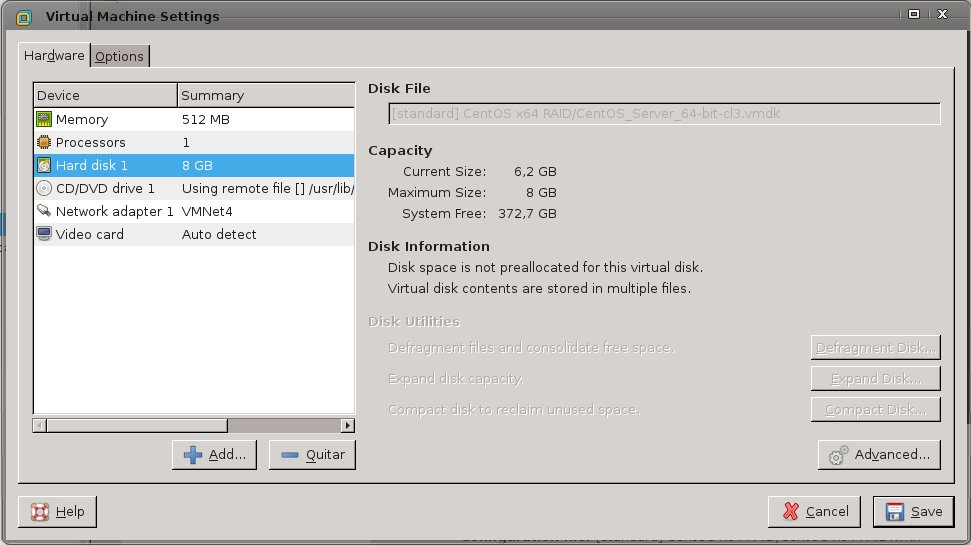
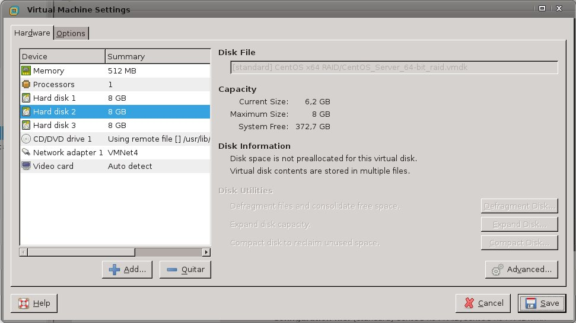
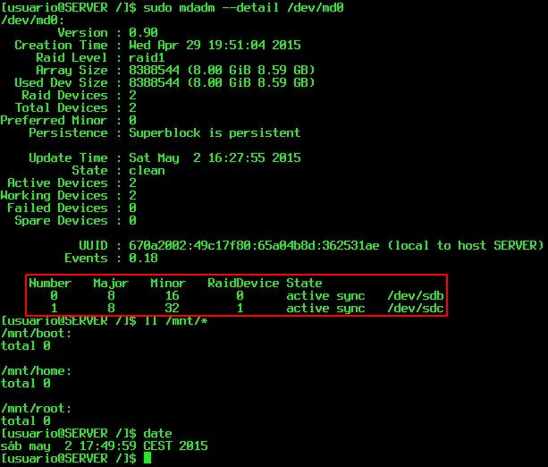
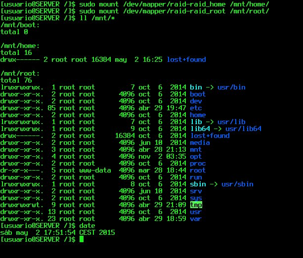
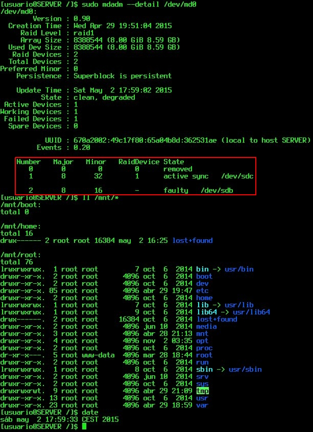
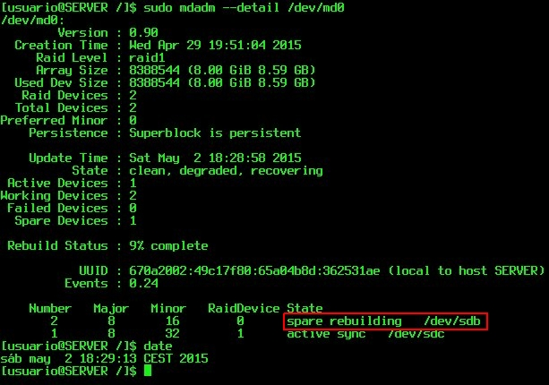

Practica 6 
==========
*Replicando datos en dos discos duros*

### Objetivos
En esta práctica configuraremos dos discos en RAID 1 por software, usando una
maquina virtual con Centos 7.1. Esta configuración RAID ofrece una gran
seguridad al replicar los datos en los dos discos.


## Pasos realizados
> * Paso 1 <br />
> Tenemos que añadir a la maquina virtual los discos duros virtuales que nos van a servir para realizar el RAID 1 de discos. <br />
> * Paso 2 <br />
> Una vez que hemos añadido los discos tenemos que hacer que nuestro sistema operativo los reconozcan para que podamos montar el RAID1. <br />
> * Paso 3 <br />
> En este paso es cuando realmente se monta el RAID1 de discos. <br />
> * Paso 4 <br />
> En este paso es cuando le damos formato al disco para poder utilizarlo para almacenar datos, una vez que hemos dado formato a nuestro disco ya podemos montarlo en el sistema para poder usarlo. <br />

### Paso 1
Comprobamos la instalación de nuestro sistema:<br />

### Paso 2
Añadimos los discos duros: <br />

### Paso 3
Ejecutamos los siguientes comandos: <br />
```bash
[usuario@server /]$ sudo fdisk -l
[sudo] password for usuario:

Disk /dev/sda: 8590 MB, 8590983168 bytes, 16779264 sectors
Units = sectors of 1 * 512 = 512 bytes
Sector size (logical/physical): 512 bytes / 512 bytes
I/O size (minimum/optimal): 512 bytes / 512 bytes
Disk label type: dos
Identificador del disco: 0x0008bbde
                                                                                                                                                       
Disposit. Inicio    Comienzo      Fin      Bloques  Id  Sistema
/dev/sda1   *        2048     1026047      512000   83  Linux
/dev/sda2         1026048    16779263     7876608   8e  Linux LVM

Disk /dev/sdc: 8589 MB, 8589934592 bytes, 16777216 sectors
Units = sectors of 1 * 512 = 512 bytes
Sector size (logical/physical): 512 bytes / 512 bytes
I/O size (minimum/optimal): 512 bytes / 512 bytes
Disk label type: dos
Identificador del disco: 0x0004d31c

Disposit. Inicio    Comienzo      Fin      Bloques  Id  Sistema

Disk /dev/sdb: 8589 MB, 8589934592 bytes, 16777216 sectors
Units = sectors of 1 * 512 = 512 bytes
Sector size (logical/physical): 512 bytes / 512 bytes
I/O size (minimum/optimal): 512 bytes / 512 bytes
Disk label type: dos
Identificador del disco: 0x000c5e20

Disposit. Inicio    Comienzo      Fin      Bloques  Id  Sistema

Disk /dev/mapper/centos-swap: 859 MB, 859832320 bytes, 1679360 sectors
Units = sectors of 1 * 512 = 512 bytes
Sector size (logical/physical): 512 bytes / 512 bytes
I/O size (minimum/optimal): 512 bytes / 512 bytes


Disk /dev/mapper/centos-root: 5242 MB, 5242880000 bytes, 10240000 sectors
Units = sectors of 1 * 512 = 512 bytes
Sector size (logical/physical): 512 bytes / 512 bytes
I/O size (minimum/optimal): 512 bytes / 512 bytes


Disk /dev/mapper/centos-home: 1958 MB, 1958739968 bytes, 3825664 sectors
Units = sectors of 1 * 512 = 512 bytes
Sector size (logical/physical): 512 bytes / 512 bytes
I/O size (minimum/optimal): 512 bytes / 512 bytes

[usuario@server /]$ sudo mdadm --create /dev/md0 --level=raid1 --raid-devices=2 --metadata=1.0 /dev/sdb1 /dev/sdc1
[sudo] password for usuario:
mdadm: array /dev/md0 started.
[usuario@server /]$ sudo mdadm --create /dev/md1 --level=raid1 --raid-devices=2 /dev/sdb2 /dev/sdc2
mdadm: array /dev/md1 started.

```
Como podemos ver desde la salida de consola podemos ver que aparte de los dos discos (sdb, sdc)que hemos añadido a nuestro sistema también, tiene hay un tercer disco que contiene una partición LVM, con tres particiones que contienen, home, root, swap, así después de ver esto lo que vamos a intentar es pasar todas las particiones a nuestro disco RAID1.

### Paso 4
Le damos formato a nuestro disco para poder pasar los datos pero como vamos a usarlo de una manera muy particular ponemos los mismos tamaños que tiene las particiones home, root y swap que tiene nuestro disco origen. <br />
Como hemos hecho 2 particiones y cada una de ellas tiene un formato diferente puesto que una de ellas la vamos a usar para el arranque del sistema tenemos que utilizar diferentes comandos para formatear las unidades RAID. <br />

```bash
01-[usuario@server /]$ sudo mkfs.xfs -b size=512 -L raid_boot -f /dev/md0p1
02-[usuario@server /]$ sudo pvcreate /dev/md0p2
03-[usuario@server /]$ sudo vgcreate raid /dev/md0p2
04-[usuario@server /]$ sudo lvcreate -L 4,9G -n raid_root raid 
05-[usuario@server /]$ sudo lvcreate -L 792M -n raid_swap raid
06-[usuario@server /]$ sudo lvcreate -L 1,82G -n raid_home raid
07-[usuario@server /]$ sudo mkfs.ext4 /dev/mapper/raid-raid_root
08-[usuario@server /]$ sudo mkfs.ext4 /dev/mapper/raid-raid_home
09-[usuario@server /]$ sudo mkswap /dev/mapper/raid-raid_swap
10-[usuario@server /]$ sudo dd if=/dev/mapper/centos-root of=/dev/mapper/raid-raid_root bs=512 conv=noerror,sync
11-[usuario@server /]$ sudo dd if=/dev/mapper/centos-home of=/dev/mapper/raid-raid_home bs=512 conv=noerror,sync
12-[usuario@server /]$ sudo dd if=/dev/sda1 of=/dev/md0p1 bs=512 conv=noerror,sync
```
Si nos fijamos en las lineas de arriba podemos darnos cuenta que la linea 01 se encarga de dar formato a la partición de arranque del nuevo disco, como en estos discos RAID también los vamos a dotar de las utilidades que nos dan las particiones LVM, pues utilizamos los comandos de las lineas 02 y 03 para crear el volumen físico y el grupo del volumen físico en la segunda partición del disco RAID, después de eso lo que hacemos es crear unidades lógicas para que alberguen nuestro sistema de archivos, en este caso vamos a utilizar el sistema ext4 (lineas 07 y 08) para las particiones de root y home. <br />
Después de esto creamos la partición de swap para el nuevo disco, en la linea 09, realizamos esta operación y ya por ultimo lo que nos queda es pasar toda la información de las particiones que tiene nuestro disco origen a nuestro disco RAID destino. <br />
Estas operaciones están reflejadas desde la linea 10 hasta la linea 12. Por ultimo y para poder ver que todos los datos se ha transferido correctamente en las siguientes lineas montaremos las unidades que hemos creado para poder listar sus contenidos.<br />

```bash
[usuario@server /]$ sudo mount /dev/mapper/raid-raid_root /mnt/root
[usuario@server /]$ sudo mount /dev/mapper/raid-raid_home /mnt/home
```
Antes de montar las particiones <br />
<br />

Después de montar las particiones <br />
<br />

## Operaciones Adicionales
Esta ultima parte es extra y lo que vamos a mostrar es como al quitar uno de los discos que componen el RAID podemos seguir trabajando perfectamente con la maquina sin que esta se vea afectada por la ruptura de dicho componente.<br />

```bash
[usuario@server /]$ sudo mdadm --manage --set-faulty /dev/md0 /dev/sdb
```

Después forzar el fallo por software <br />
<br />

Una vez comprobado el estado de los discos duros lo unico que hace falta es borrar el disco del RAID y volverlo a añadir<br />

```bash
[usuario@server /]$ sudo mdadm --manage --remove /dev/md0 /dev/sdb
[usuario@server /]$ sudo mdadm --manage --add /dev/md0 /dev/sdb
```
<br />

### Bibliografía
How to RAID on Linux -- http://tldp.org/HOWTO/Software-RAID-HOWTO-6.html

### Conclusiones
Esta practica ha sido bastante sencilla, la única complicación, por buscar alguna, es intentar montar el sistema RAID de un sistema operativo ya montado, osea que una vez tenemos el sistema operativo Linux instalado en la maquina, tenemos que montar el sistema RAID en el disco duro donde se aloja el sistema sin perder la información que ya tenemos instalada. <br />

