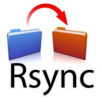
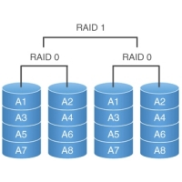

Asignatura SWAP 14/15
=====================
*Presentación*

En este repositorio guardaremos todas las practicas de la asignatura SWAP

### Objetivos
|Descripción|
|:---|
|Esta claro que en esta asignatura, lo que se pretende es llevar a buen puerto la creación de un granja de servidores para que esta pueda soportar un gran carga de trabajo sin que se vea afectada por ello.|

### Ejercicios de Clase
|Descripción||
|:---|---:|
|En la carpeta de ejercicios de clase iremos añadiendo las respuestas de las preguntas propuestas en clase, estas preguntas son las que luego se usarán para el examen de la asignatura, así se generan en xml para poder usar el script [tests.html](https://rawgit.com/elsudano/Facultad/FACULTAD/03Tercero/Servidores_Web_Altas_Prestaciones_SWAP/tests.html)|||

### Primera Práctica
|Descripción||
|:---|---:|
|En la primera practica crearemos un repositorio en github y utilizar la herramienta git para realizar la subida y descargas de los diferentes ficheros de configuración necesarios para la correcta configuración de los servidores.||

### Segunda Práctica
|Descripción||
|:---|---:|
| En la segunda practica utilizaremos las herramientas rsync, para poder replicar la configuración entre los distintos servidores y así poder tener la seguridad de que si perdemos un servidor tendremos otro de respaldo.||

### Tercera Práctica
|Descripción||
|:---|---:|
|Balanceo de carga en una granja web, utilizaremos haproxy y nginx, como balanceadores de carga para repartir el trabajo en nuestra granja de servidores, por supuesto son balanceadores software, pero los compararemos con balanceadores hardware.||

### Cuarta Práctica
|Descripción||
|:---|---:|
|Evaluación de prestaciones, en esta practica comprobaremos que rendimiento puede darnos nuestra granja web con nuestro balanceador, y si es posible montar un pequeño CPD virtualizado ||

### Quinta Práctica
|Descripción||
|:---|---:|
|Replicación de bases de datos maestro-esclavos, y también maestro-maestro, esta ultima es un poco mas complicada de configurar pero nos da un plus a la hora de replicar nuestras bases de datos puesto que el ordenador que se queda siempre va a poder replicarse de forma autónoma.||

### Sexta Práctica
|Descripción||
|:---|---:|
|Configuración de discos en RAID, tal y como hicimos en asignaturas anteriores intentaremos replicar la información en diferentes discos duros para conseguir que nuestros datos, aparte de tener la consistencia necesaria, también estén seguros frentes a posibles catástrofes.||
